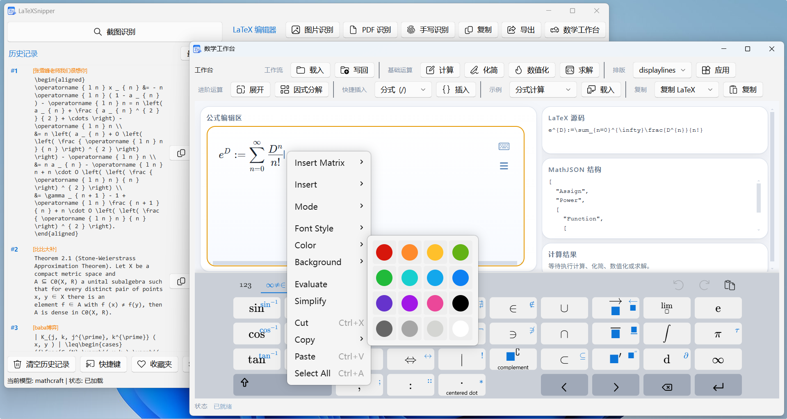
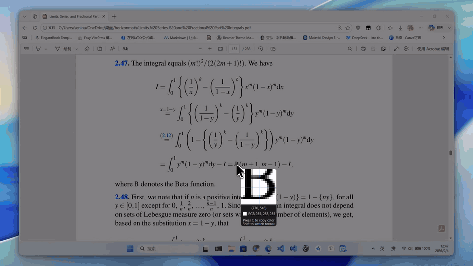
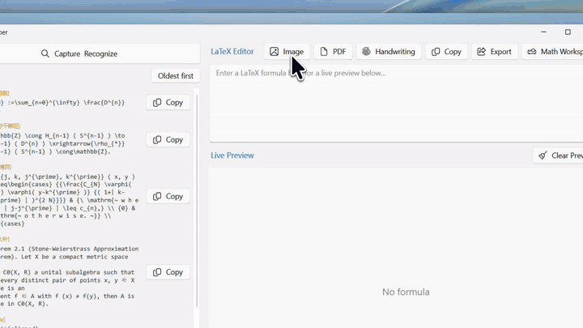
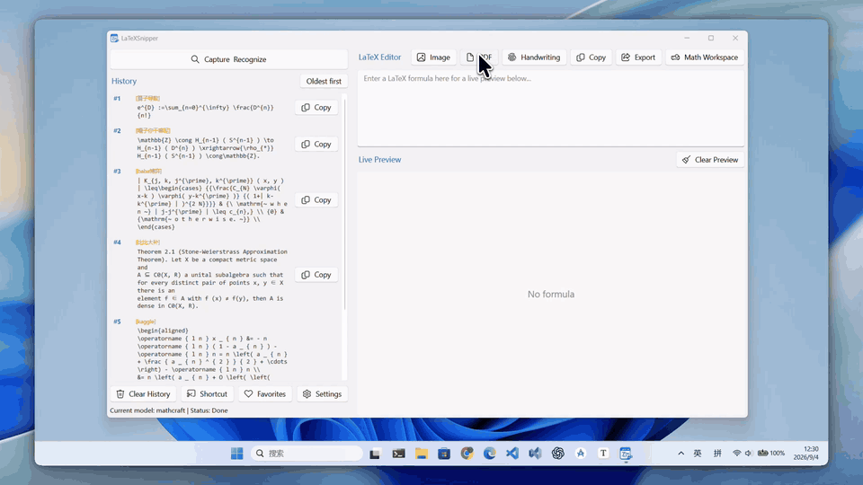

# LaTeXSnipper ✨

将截图、图片、PDF 和手写内容转换为可编辑的公式与文本。

**[下载桌面端](https://github.com/SakuraMathcraft/LaTeXSnipper/releases/latest)** · [用户手册](user_manual/user_manual.md) · [常见问题](docs/faq.md) · [功能演示](#功能演示)

[English](readme.md) · 简体中文

## 核心功能

| 功能 | 你可以做什么 |
|---|---|
| 📸 识别 | 框选截图、打开图片、选择 PDF 页面或手写，识别公式、文本和图文混排内容 |
| ⌨️ 编辑与计算 | 使用 MathLive 和实时预览编辑公式，在数学工作台中化简、求值和求解 |
| 🔄 导出 | 复制公式或导出文档，支持 LaTeX、MathML、Word、PDF、Typst 等 20 种格式 |
| 🧩 集成 | 在 Word/PowerPoint 中使用，或通过 Automation API 连接脚本与其他工具 |
| 🔐 模型选择 | 下载依赖和权重后在本地运行 MathCraft OCR，也可配置本地或线上外部模型 |
| 🌐 个性化 | 中英文界面、亮暗主题、自定义快捷键、历史记录与收藏夹 |

MathCraft OCR：[基准测试结果](https://github.com/SakuraMathcraft/MathCraft-Models/tree/main/benchmarks) · [复现套件](benchmarks/mathcraft_ocr/README.md)

## 下载与开始使用

1. **安装桌面端。** 从 [Releases](https://github.com/SakuraMathcraft/LaTeXSnipper/releases/latest) 下载对应系统的安装包。
2. **准备识别环境。** 首次启动时，在依赖管理中安装 MathCraft OCR 所需依赖层及 CPU 或 GPU 后端；首次模型初始化需要下载权重。如果仅使用外部模型，请在设置中配置服务并测试连接。
3. **开始识别与编辑。** 使用截图识别、图片、PDF 或手写入口，然后查看、复制或导出结果。

| 平台 | 下载文件 | 使用识别前注意 |
|---|---|---|
| Windows | `LaTeXSnipperSetup-<version>.exe` | 已包含 Python 运行时，无需另装系统 Python |
| Linux（Debian/Ubuntu） | 对应架构的 `.deb` | 需要 Python `>=3.10,<3.14` 及 venv/pip；Wayland 可能限制截图和全局快捷键 |
| macOS | 对应架构的 `.dmg` 或 `.app.zip` | 需要 Python `>=3.10,<3.14` 及 venv/pip；截图需授予屏幕录制权限 |

Linux/macOS 使用系统 Python 创建受管理的依赖环境，Windows 使用内置 Python 3.11 模板。`.deb` 声明了 `python3` 和 `python3-venv` 依赖；macOS 若没有可用 Python，请先安装受支持的版本。

权限、模型下载、环境目录及故障排查见 [常见问题](docs/faq.md)、[用户数据位置](docs/user_data_storage.md) 和 [完整用户手册](user_manual/user_manual.md)。

## 功能演示

### 截图识别

### 图片识别

### PDF 识别

## Microsoft Office 插件

在 Windows 桌面版 Word 和 PowerPoint 中直接插入与编辑公式：

- 支持 Word OLE/OMML 与 PowerPoint OLE/PNG 插入，保留可编辑的 LaTeX 源码。
- 支持公式编辑、更新，以及 Word 自动编号和引用。
- 本地渲染公式，通过桌面端 Automation API 调用截图识别。

从 [Releases](https://github.com/SakuraMathcraft/LaTeXSnipper/releases/latest) 单独下载 `OfficePluginSetup-<version>.exe`。支持 Windows 上的 32 位和 64 位 Office 2019/2021/2024、LTSC 2021/2024 及 Microsoft 365 Apps。

[安装要求与完整功能](office_plugin/README.md) · [公式工作流](docs/office_plugin_formula_workflows.md)

## Automation API

通过脚本、批量程序、编辑器集成或经授权的远程设备，调用 MathCraft 或已配置的外部模型。

- **桌面快捷操作：** 将 Snipaste、AutoHotkey、AutoKey、Hammerspoon 或 ShareX 接入图片识别流程。
- **批量与编辑器工作流：** 使用 Python/curl 提交图片，将结果插入自己的工具。
- **手机远程调用：** 使用快捷指令或 Tasker，通过安全隧道连接正在运行的桌面端。

接口**默认关闭**。本机客户端从 `automation-api.json` 读取地址和 token；远程访问需显式开启、使用独立密钥，并通过 HTTPS 或加密隧道连接，不要以明文 HTTP 暴露到公网。远程外部模型调用单独授权，可能产生服务商费用。

[API 文档与连接配置](docs/automation_api.md) · [客户端示例](examples/automation/)

## 导出

内置导出覆盖 LaTeX、Markdown 公式、MathML、HTML、Word OMML 和 SVG 代码。在依赖管理中安装可选的 **Pandoc** 层后，可导出 Word、PowerPoint、EPUB、PDF、Typst 等文档；PDF 导出还需要 LaTeX PDF 引擎。

完整格式列表与要求见 [用户手册](user_manual/user_manual.md)。

## 支持者名单

感谢所有参与开发、测试、文档和社区支持的朋友。

| 支持者 | 贡献 |
|---|---|
| [strangelion](https://github.com/strangelion) | 贡献者 |
| [Galileo927](https://github.com/Galileo927) | 贡献者 |
| [ljygo](https://github.com/ljygo) | 赞助者 |
| [Yokie-D](https://github.com/Yokie-D) | 赞助者 |

## 支持本项目

LaTeXSnipper 是免费开源、无广告、无内购的个人项目。如果它对你有帮助，欢迎点亮 Star、分享给有需要的人、[反馈问题](https://github.com/SakuraMathcraft/LaTeXSnipper/issues)，或赞助项目维护。

| 支付宝 | 微信 | 中文交流群 |
|:---:|:---:|:---:|
|  |  |  |

## 许可证

[GNU General Public License v3](LICENSE)。
