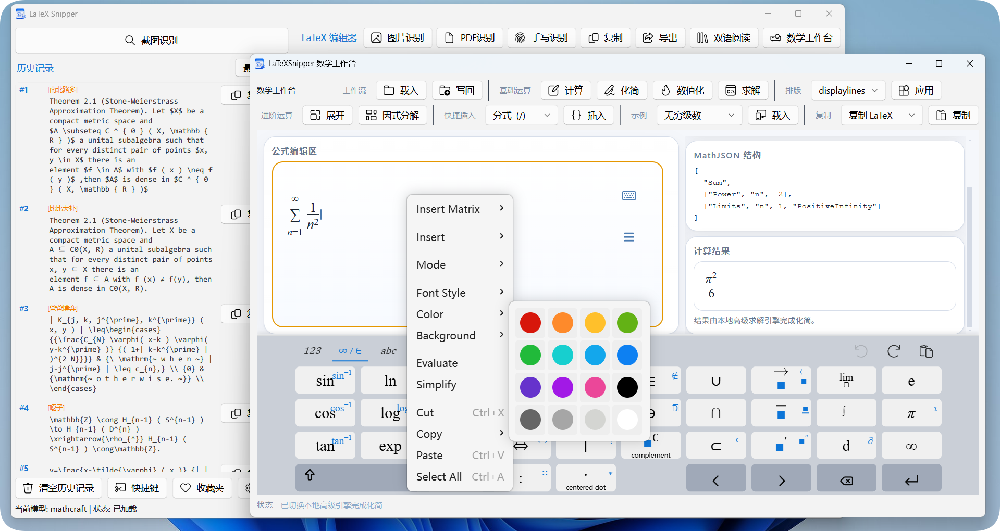
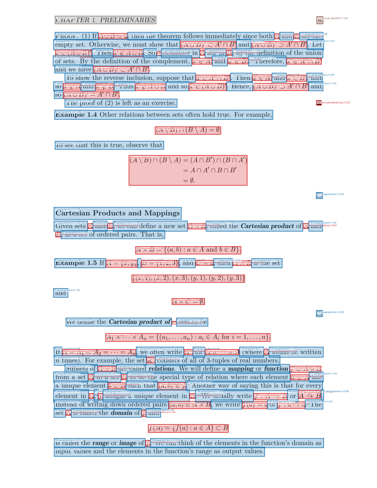
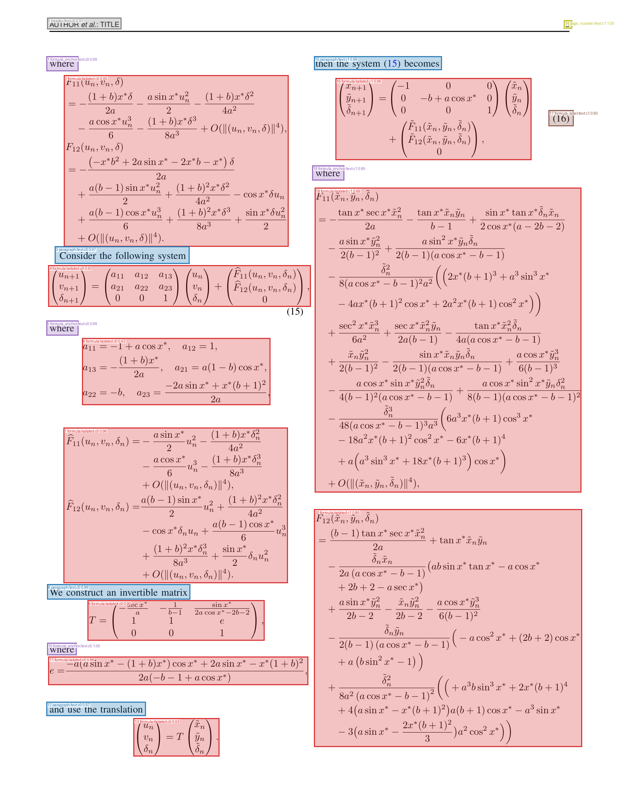

<!-- LaTeXSnipper 用户手册 -->
<!-- 版本: v2.3.2 | 更新: 2026-05 -->

<div align="center">

# LaTeXSnipper

## 用户手册

*适用于 v2.3.2_Final_Stable | 持续更新中*

---



</div>

---

## 目录

### 第一卷 · LaTeXSnipper 用户指南

- [开始使用前（必读）](#开始使用前必读)
- [本地模型（MathCraft ONNX）相关问题](#本地模型mathcraft-onnx相关问题)
- [外部模型相关问题](#外部模型相关问题)
- [安装和环境问题](#安装和环境问题)
- [网络与更新问题](#网络与更新问题)
- [PDF 与识别效果问题](#pdf-与识别效果问题)
- [使用技巧与功能问题](#使用技巧与功能问题)
- [平台特定问题（Linux / macOS）](#平台特定问题linux--macos)
- [与其他软件冲突](#与其他软件冲突)
- [从源码运行与开发者常见问题](#从源码运行与开发者常见问题)
- [如何有效反馈 Bug](#如何有效反馈-bug)

### 第二卷 · MathCraft 内部模型介绍

- [MathCraft OCR 项目介绍](#mathcraft-ocr-项目介绍)
- [环境变量设置指南](#环境变量设置指南)

---

<div align="center">

# 第一卷 · LaTeXSnipper 用户指南

---

</div>

---

## 开始使用前（必读）

### 安装后第一步：运行依赖向导

LaTeXSnipper 首次启动时会弹出"依赖向导"。这不是可有可无的步骤——向导负责安装和配置运行所需的 Python 依赖层（包括 OCR 引擎、预览渲染等）。

> [!WARNING]
> **常见错误：跳过向导直接使用**
>
> 如果点"跳过"或向导中途失败，后续截图识别、公式预览、手写识别等功能将无法正常工作。
> 向导只管理 Python 依赖层，不会安装或卸载系统软件包（如 apt/brew 等）。

如果向导本身运行失败：

- **Windows：** 确保以普通用户（非管理员）运行，且杀毒软件未拦截
- **Linux：** 确保 `python3 -m venv` 可用（Debian/Ubuntu 通常需要 `python3-venv`）
- **macOS：** 确保有可用的 Python 3.10+，推荐 Homebrew Python 或 python.org 官方安装包

### 软件的基本工作流

> [!NOTE]
> **了解这个流程可以避免 80% 的困惑**
>
> **截图 → 识别 → 编辑/预览 → 导出**，具体来说：
>
> - **主窗口截图：** 按下截图快捷键（默认见设置），框选公式区域
> - **识别结果：** 自动出现在主窗口列表，双击可查看 LaTeX 源码和渲染预览
> - **编辑区：** 主窗口右侧是 LaTeX 编辑器，支持实时预览渲染
> - **数学工作台：** 点击"数学工作台"按钮打开独立窗口，会自动载入主编辑器中的公式。在工作台中可以编辑公式、进行数值计算或表达式化简，完成后可写回主编辑器
> - **手写识别：** 从主窗口打开手写窗口，内置识别固定使用 MathCraft 混合模式，手写文字和公式会一起识别
> - **导出：** 右键或菜单可选择 30+ 种格式导出（部分需要 Pandoc）

### 日志文件在哪里（关键！）

遇到任何问题时，第一步永远是 <span style="color:#C62828;font-weight:bold;">查看日志</span>：

- **Windows：** `%USERPROFILE%\.latexsnipper\logs\` 或 `%LOCALAPPDATA%\LaTeXSnipper\logs\`
- **Linux：** `~/.latexsnipper/logs/`
- **macOS：** `~/.latexsnipper/logs/`
- **崩溃日志：** 同目录下的 `crash-native.log`

> [!TIP]
> **建议：** 反馈 Bug 时把整个 `logs` 目录打包发过来，不要只截图报错弹窗。

---

## 本地模型（MathCraft ONNX）相关问题

> [!TIP]
> **MathCraft ONNX 用户提示**
>
> 应用会自动下载并 `warmup()`，如果 warmup 失败会尝试重新下载。但如果网络慢，下载模型可能很久。
> 可以先用 `python -m mathcraft_ocr models check` 检查缓存状态。

### 模型下载失败（网络问题 / 代理 / 防火墙）

**现象：** 启动或首次使用时卡在 "model xxx downloading"，然后失败。

**原因：**

- 模型托管在 GitHub Releases 等境外服务器，国内用户可能无法直接访问
- 公司/学校网络有防火墙拦截
- 代理设置不正确导致 `urllib` 无法连接

**解决：**

- 检查网络是否能访问 GitHub
- 设置环境变量 `HTTP_PROXY` / `HTTPS_PROXY`（如果使用代理）
- 尝试切换网络（如手机热点）
- 删除 MathCraft 模型缓存目录下残留的不完整下载后重试：
  - Windows：`%APPDATA%\MathCraft\models\`
  - Linux/macOS：`~/.mathcraft/models/`

> [!TIP]
> **命令行诊断**
>
> 运行 `python -m mathcraft_ocr models check` 可以查看模型缓存状态。
> 运行 `python -m mathcraft_ocr models download` 可以手动触发下载。

### onnxruntime 安装不完整或版本不对

**现象：** 启动报 `failed to import onnxruntime` 或 `missing get_available_providers`。

**原因：**

- 可能安装了 `onnxruntime` 的命名空间包而非完整包
- pip 安装时网络中断导致包不完整
- CPU 版和 GPU 版冲突

**解决：**

- `pip uninstall onnxruntime onnxruntime-gpu` 全部卸载后重新安装
- 如需 GPU 加速：`pip install onnxruntime-gpu`
- 仅 CPU：`pip install onnxruntime`

### CUDA / GPU 相关错误

**现象：** warmup 时报 CUDA 相关错误，如 `cuda wasn't able to be loaded`、`cublas` 错误等。

**原因：**

- 安装了 `onnxruntime-gpu` 但没装 CUDA / cuDNN
- CUDA 版本与 onnxruntime-gpu 不匹配
- 显卡驱动太旧
- 多 GPU 环境下默认选错了设备

**解决：**

- **如果不需要 GPU：** 设置环境变量 `MATHCRAFT_FORCE_ORT_CPU=1` 强制 CPU 模式
- **如果需要 GPU：** 确认 CUDA Toolkit 和 cuDNN 版本与 onnxruntime-gpu 匹配（查 onnxruntime 官方兼容表）
- 更新显卡驱动

### 模型缓存损坏（下载一半断电 / 杀进程）

**现象：** warmup 报 `invalid protobuf`、`failed to load model`、`sha256 mismatch`。

**原因：** 下载过程中断导致模型文件不完整；或者磁盘故障导致文件损坏。

**解决：**

- 删除对应模型目录：Windows 为 `%APPDATA%\MathCraft\models\<model_id>\`，Linux/macOS 为 `~/.mathcraft/models/<model_id>/`
- 重启应用，会自动重新下载
- 或用命令行：`python -m mathcraft_ocr models check` 检查缓存状态

### 显存不足导致 ONNX 模型加载失败

**现象：** warmup 报 CUDA out of memory 或直接崩溃。

**原因：** GPU 显存不够。应用会根据显存选择批大小，但如果其他程序（浏览器、游戏）占了显存，剩余不够。

**解决：**

- 关闭其他占用 GPU 的程序
- 设置 `MATHCRAFT_FORCE_ORT_CPU=1` 强制使用 CPU

---

## 外部模型相关问题

### 根本没配置外部模型，直接点识别然后报错

**现象：** 截图后识别失败，提示"模型名为空"或"外部模型地址为空"。

> [!CAUTION]
> **错误原因**
>
> 外部模型客户端 `_validate_config()` 要求 provider 非 mineru 时 `model_name` 和 `base_url` 不能为空。
> 默认 `model_name` 就是空字符串，你需要手动填写。

**解决：** 先去 **设置 → 外部模型**，至少填上 Base URL 和模型名（或选择预设），点"测试连接"通过后再使用。

### 模型没预热（冷启动），第一次调用巨慢或超时

**现象：** 首次 OCR 识别等待很久（可能超过 60 秒），然后报超时。

**原因：** vLLM / Ollama / 本地 ONNX 模型首次加载需要将模型读入内存/显存，尤其是大模型（7B+）。默认超时仅 60 秒。

**解决：**

- **方案 A：** 首次使用前先手动调用一次预热（用 curl 或 Ollama 的 API 测试页面）
- **方案 B：** 在设置里把超时提高到 120-180 秒
- **方案 C：** Ollama 用户可以先 `ollama run <model_name>` 确保模型已在内存中

### Ollama 已启动但 Base URL 填错

**现象：** 测试连接报"无法连接到 127.0.0.1:11434"。

**常犯错误：**

- 填了 `http://localhost:11434/v1`（Ollama **不需要** `/v1` 后缀）
- 填了 `https://` 而不是 `http://`（本地 Ollama 默认不开 HTTPS）
- Ollama 服务实际监听在其他端口，但用户没改端口号
- Ollama 根本没启动（`ollama serve` 没运行）

> [!TIP]
> **快速验证：** 先在浏览器访问 `http://127.0.0.1:11434/api/tags`，如果返回 JSON 就说明正常。

### 模型名拼写错误 / 大小写不对

**现象：** 测试连接提示"模型名不存在: xxx"，然后列出可用模型。

**原因：** 模型名必须完全一致，包括大小写。

**解决：**

- Ollama 用户执行 `ollama list` 查看确切模型名
- OpenAI-compatible 用户查服务文档或 `/v1/models` 接口返回值

### 线上 API 用了但没填 API Key

**现象：** 测试连接或识别时报 401 "接口认证失败"。

**原因：** 线上服务（硅基流动、DeepSeek、OpenAI 等）必须提供 API Key。本地 Ollama 通常不需要。

**解决：** 在设置的 API Key 栏填入正确的密钥。

> [!WARNING]
> **安全提醒**
>
> API Key 是敏感信息，请勿分享给他人或上传到公开仓库。
> LaTeXSnipper 不会将你的 API Key 发送到除你指定的 Base URL 以外的任何地方。

### MinerU 协议选了但是服务端没配好

**现象：** 测试连接报 404 或 409。

**原因：** MinerU 的默认测试端点是 `/health`，默认解析端点是 `/file_parse`。不同版本可能用不同路径。

**解决：**

- 先确认 MinerU 服务是否在运行：浏览器访问 `http://127.0.0.1:8000/health`
- 如果路径不对，在设置中修改"解析接口路径"和"健康检查路径"
- MinerU 409 错误通常表示解析任务失败，查看 MinerU 服务端日志

### 选了 OpenAI-compatible 协议但服务是 Ollama

**现象：** 测试连接时访问 `/v1/models` 返回 404。

**原因：** Ollama 的模型列表接口是 `/api/tags`，不是 `/v1/models`。

**解决：** 把协议从 "OpenAI-compatible" 改成 "Ollama"。

> [!NOTE]
> **协议选择速查**
>
> - Ollama 服务 → 选 **Ollama**
> - 硅基流动 / DeepSeek / OpenAI / Groq 等 → 选 **OpenAI-compatible**
> - MinerU 服务 → 选 **MinerU**
> - 本地 MathCraft ONNX → 选 **MathCraft ONNX**

### 自定义提示词把系统提示覆盖了导致输出格式错乱

**现象：** 填写了自定义提示词后，输出变成了自然语言解释而不是 LaTeX 代码。

**原因：** 自定义提示词优先级最高，会完全覆盖模板提示词。如果你写的提示词没有强调"只输出 LaTeX"，模型可能会自由发挥。

**解决：** 如果不确定怎么写，清空自定义提示词，只用模板。

---

## 安装和环境问题

### Python 版本不对

**现象：** 安装或运行时出现语法错误或不兼容提示。

**原因：** 不同场景的 Python 要求不同，不能混用。

**解决：**

- **普通 Windows 安装包用户：** 不需要单独安装 Python，安装包自带规范化的 Python 3.11 模板环境。
- **Linux/macOS 安装包用户：** 需要系统中有可用 Python 3.10+，仅用于创建用户目录下的隔离依赖环境。
- **源码运行/开发者：** 推荐 Python 3.11，与当前 Windows 打包环境保持一致。

```bash
# Python 3.11 创建虚拟环境
python3.11 -m venv .venv

# Windows 激活
.\.venv\Scripts\activate

# Linux/macOS 激活
source .venv/bin/activate

# 安装依赖
pip install -r requirements.txt
```

### PyInstaller 打包版和开发版行为不同

**现象：** 从 GitHub Release 下载的 exe 能跑，但 `git clone` 后用源码跑不了。

**原因：** 打包版和源码版的环境边界不同。Windows 安装包包含规范化的 Python 3.11 模板环境；Linux/macOS 安装包只包含 PyInstaller 应用本体，Python 依赖层会在用户目录中创建。源码运行则完全依赖你自己的开发环境。

**解决：**

- **如果是用户：** 优先使用 Release 版本，不要自己从源码跑
- **如果是开发者：** 按照 `requirements.txt` 和 `requirements-build.txt` 安装依赖

### Linux/macOS 依赖环境创建在哪里

Linux/macOS 安装包不会把构建机的 `tools/deps/python311` 或任意虚拟环境打进安装包。首次需要 MathCraft、Pandoc 等 Python 依赖层时，会在用户可写目录创建：

```text
~/.latexsnipper/deps/python311
```

> [!NOTE]
> **为什么这样设计**
>
> Linux/macOS 的安装目录通常位于 `/usr/lib/latexsnipper` 或 `.app` 包内部，普通用户没有写权限。
> 将依赖层放在 `~/.latexsnipper/deps/python311` 可以避免权限错误，也避免把开发者机器上的 venv、`pyvenv.cfg`、CI 路径打进安装包。

Linux `.deb` 会声明 `python3` 和 `python3-venv` 依赖；macOS 没有 `.deb` 这种系统依赖声明机制，如果找不到可用 `python3`，请先安装：

```bash
# Homebrew
brew install python

# 或使用 python.org 官方 macOS 安装包
https://www.python.org/downloads/macos/
```

### pip 依赖安装失败（特别是 pywin32 / PyQt6）

**现象：** `pip install -r requirements.txt` 报错。

**原因：**

- `pywin32` 需要编译或特定 wheel
- `PyQt6` 体积大约束多
- 某些包在国内 PyPI 镜像可能没有及时同步

**解决：**

- 使用清华/阿里云 PyPI 镜像：

  ```bash
  pip install -i https://pypi.tuna.tsinghua.edu.cn/simple -r requirements.txt
  ```

- `pywin32` 如果 pip 装不上，去 PyPI 手动下载 wheel 安装

### 权限问题（Program Files / 系统目录）

**现象：** 安装在 `C:\Program Files\` 下运行报权限错误。

**原因：** 应用需要在用户目录（`%APPDATA%`、`~/.latexsnipper/`）写入日志、配置、模型缓存。如果应用本身放在受保护目录，某些操作可能被 UAC 拦截。

**解决：**

- 不要安装到需要管理员权限的目录
- 用户级安装（`%LOCALAPPDATA%` 下）通常没有问题

### 中文路径 / 用户名包含特殊字符

**现象：** 启动崩溃或模型加载失败。

**原因：** Windows 用户名含中文、空格、特殊符号时，`%APPDATA%` 路径可能包含非 ASCII 字符，某些 C 库或 ONNX 底层可能无法正确处理。

**解决：** 设置环境变量 `MATHCRAFT_HOME` 指向一个纯 ASCII 路径，例如 `C:\mathcraft_data`。

---

## 网络与更新问题

### Windows 防火墙拦截本地服务

**现象：** Ollama / MinerU 等服务已启动，但 LaTeXSnipper 连不上。

**原因：** Windows Defender 防火墙可能拦截了本地回环连接。

**解决：**

- 检查防火墙设置，允许 Python / Ollama 通过
- 临时关闭防火墙测试（仅用于排查）
- 确认 Ollama 监听在 `0.0.0.0` 还是 `127.0.0.1`

### 更新检查失败

**现象：** 检查更新时一直转圈或报错。

**原因：** 更新检查访问 `api.github.com`，国内可能被墙或很慢。

**解决：**

- 设置代理后重试
- 直接去 GitHub Releases 手动下载最新版
- 查看 `%USERPROFILE%/.latexsnipper/logs/` 下的日志了解具体错误

### 杀毒软件误报 / 拦截

**现象：** exe 被删除、隔离或阻止运行。

**原因：** PyInstaller 打包的 exe 有时被误报为木马。

**解决：**

- 将安装目录加入杀毒软件白名单
- **确保从 GitHub Releases 下载**（官方版本已通过 SignPath 签名验证）

---

## PDF 与识别效果问题

### PDF 识别结果很乱

**现象：** 用外部模型识别 PDF 效果很差。

**原因：**

- DPI 设得太低（< 100）或太高（> 200）
- 扫描件与文字型 PDF 处理方式不同
- 提示词模板不匹配（用了公式模板去识别文档）

**解决：**

- 文字型 PDF：尝试 140-170 DPI
- 扫描件：尝试 200-300 DPI
- 确认设置中"输出偏好"和提示词模板与任务匹配

### 切换了输出模式但结果没变

**现象：** 设置里选了 LaTeX 输出，但返回的还是 Markdown。

**原因：** 自定义提示词会覆盖输出模式设置；MinerU 协议走原生接口，不受输出偏好影响。

**解决：** 清空自定义提示词、确认协议类型。

### 大图片 / 高分辨率截图识别失败

**现象：** 截了 4K 屏幕的图，识别直接报错或超时。

**原因：** 图片太大，Base64 编码后体积膨胀约 33%，可能超过服务端请求体大小限制，或传输太慢导致超时。

**解决：**

- 缩小截图范围
- 降低截图分辨率
- 提高超时时间

---

## 使用技巧与功能问题

### 截图快捷键不生效

**现象：** 按下截图快捷键后没有任何反应。

**可能原因与解决：**

- **快捷键被其他软件占用：** 输入法、词典取词、录屏软件可能占用全局快捷键。暂时关闭这些软件，或在设置中更换截图快捷键
- **权限不足（Linux/macOS）：** Wayland 下部分截图方式需要额外权限，参阅平台特定章节
- **最小化到托盘了？** 检查系统托盘，右键图标确认应用是否在后台运行

### 导出功能不可用（Pandoc 相关）

**现象：** 导出 Word / EPUB / Typst 等格式时报错或选项灰色。

**原因：** 这些格式依赖 Pandoc。Pandoc 是可选的外部工具。

**解决：**

- 打开依赖向导，安装 "PANDOC" 层
- 或手动安装 Pandoc（<https://pandoc.org>）并确保在 PATH 中
- 核心功能（LaTeX / Markdown / MathML / HTML 导出）不需要 Pandoc

### 手写识别不触发 / 延迟太高

**现象：** 在手写窗口写完公式后没反应，或延迟很长才识别。

**原因：**

- OCR 服务未就绪（内置 MathCraft 混合模式未加载，或外部模型未连接）
- 网络延迟（使用远程外部模型时）
- 触控笔驱动问题

**解决：**

- 打开手写窗口后，程序会后台预热 MathCraft 混合模式；首次使用可能需要等待模型加载
- 手写窗口右下角有状态指示，确认显示"就绪"
- 如果使用远程模型，检查网络延迟

### 手写识别为什么不跟随主窗口的公式/文字模式

**说明：** 手写窗口的内置识别固定使用 MathCraft 混合模式。这样可以同时保留普通文字、中文/英文标签和公式，后续"自动排版"生成文档时不会因为只走公式模式而丢失文字。

**影响：**

- 主窗口截图识别仍然可以选择公式、文字、混合或外部模型
- 手写窗口使用内置模型时固定为混合模式，并会按混合模式预热
- 如果主窗口选择了外部模型，手写窗口仍会使用外部模型，但默认采用手写混合 OCR 提示词，以 Markdown + LaTeX 形式保留文字和公式

### 手写自动排版后文字、中文或换行不符合预期

**现象：** 自动排版后普通文字被省略，中文编译异常，或多行文字在 PDF 中挤到同一行。

**当前策略：**

- 自动排版会生成完整 XeLaTeX 文档，并使用 `ctexart` 文档类
- 导言区会补齐常用数学和表格宏包，如 `amsmath`、`amssymb`、`mathtools`、`geometry` 等
- 普通文字行会按段落保留，连续文字行会自动分段，避免 PDF 中被合并到同一行
- 如果外部模型排版时吞掉了识别草稿里的普通文字，程序会尝试把这些文字合并回文档正文

### 数学工作台计算结果不对

**现象：** 输入表达式后计算返回错误结果或超时。

**原因：**

- 表达式语法问题（如隐式乘法未加 `*`）
- Compute Engine 无法处理的复杂表达式

**解决：**

- 检查表达式语法：`2x` 需要写成 `2*x`
- 应用会自动回退到 SymPy/mpmath 引擎处理复杂情况
- 对于超长运行的计算，耐心等待回退引擎结果

### 深色/浅色主题切换后显示异常

**现象：** 切换主题后某些窗口颜色错乱或文字不可见。

**解决：**

- 重启应用确保所有窗口正确应用主题
- 如果问题持续，在设置中明确选择"浅色"或"深色"而非"跟随系统"

### Pandoc 导出中文乱码

**现象：** 导出 `.docx` 或 `.epub` 后中文显示为乱码。

**原因：** Pandoc 默认可能使用非 UTF-8 编码，或缺少中文字体。

**解决：**

- 确保 Pandoc 版本 ≥ 3.0
- 导出 LaTeX PDF 时确保安装了 `ctex` 宏包或中文字体
- Word 导出后在 Word 中手动设置字体

---

## 平台特定问题（Linux / macOS）

### Linux: Wayland 下截图功能异常

**现象：** 在 Wayland 会话下截图黑屏、部分窗口无法截取或快捷键无响应。

**原因：** Wayland 的安全模型限制了应用间的屏幕捕获，Qt 的截图机制可能需要额外配置。

**解决：**

- 尝试安装并配置 `grim` + `slurp`（wlroots 系）或 `gnome-screenshot`（GNOME）
- 应用会自动检测这些工具作为回退方案
- 某些发行版需要在设置中允许屏幕共享权限

> [!NOTE]
> **Linux 依赖提示**
>
> 依赖向导只管理 Python 依赖层。`grim`、`maim`、`gnome-screenshot` 等系统工具需要用户自行通过包管理器安装。
> 这些工具是可选的回退方案——应用在 Qt 原生截图失败时自动尝试它们。

### Linux: 虚拟机或 Wayland 下启动后直接中止

**现象：** 命令行出现 `EGL not available`、`No physical devices`、`GLOzone not found`、`Failed to get system egl display`，随后程序中止。

**原因：** 这通常不是 MathCraft GPU 推理问题，而是 Qt WebEngine / Chromium 在 Wayland、虚拟机、WSL 或没有可用 DRI render 节点时无法初始化 EGL/GPU 图形后端。

**当前策略：** LaTeXSnipper 会在高风险 Linux 图形环境中自动启用软件渲染兜底。正常 X11 + 真实 GPU + 可用 `/dev/dri/renderD*` 的用户仍走原生路径，不会被强制降级。

**手动开关：**

```bash
# 强制启用 Linux 图形兜底
LATEXSNIPPER_FORCE_LINUX_GRAPHICS_FALLBACKS=1 latexsnipper

# 禁用 Linux 图形兜底，尝试原生 Qt/GPU 路径
LATEXSNIPPER_DISABLE_LINUX_GRAPHICS_FALLBACKS=1 latexsnipper
```

如果仍然无法启动，通常是系统缺少 XWayland/XCB/QtWebEngine 运行库。Debian/Ubuntu 用户可先确认这些包是否存在：

```bash
sudo apt install xwayland libxcb-cursor0 libxcb-icccm4 libxcb-image0 \
  libxcb-keysyms1 libxcb-render-util0 libxcb-xinerama0 libxkbcommon-x11-0
```

### macOS: 首次启动被阻止

**现象：** macOS 提示"无法验证开发者"或"已损坏"。

**原因：** 应用未经过 Apple 公证（notarization）。

**解决：**

- 前往 系统设置 → 隐私与安全性 → 点击"仍要打开"
- 或终端执行：`xattr -cr /Applications/LaTeXSnipper.app`

### macOS: 截图权限弹窗

**现象：** 首次截图时系统弹窗要求授予屏幕录制权限。

**解决：**

- 在系统设置 → 隐私与安全性 → 屏幕录制中勾选 LaTeXSnipper
- 可能需要重启应用

### macOS: 没有可用 pip 或 pip 版本太低

**现象：** 依赖向导提示找不到 `pip`，或安装依赖时出现 `pip` / `setuptools` / `wheel` 版本过低。

**原因：** macOS 安装包不内置完整 Python 依赖环境，需要借助系统中可用的 Python 3.10+ 创建 `~/.latexsnipper/deps/python311`。如果系统 Python 没有 `venv` / `ensurepip` / `pip`，依赖层无法自动初始化。

**解决：**

- 推荐安装 Homebrew Python：`brew install python`
- 或安装 python.org 官方 macOS Python 包
- 重新启动 LaTeXSnipper 后再运行依赖向导

### 各平台数据目录速查

```
配置文件 & 日志：
  Windows:  %USERPROFILE%\.latexsnipper\
  Linux:    ~/.latexsnipper/
  macOS:    ~/.latexsnipper/

Linux/macOS Python 依赖环境：
  Linux:    ~/.latexsnipper/deps/python311
  macOS:    ~/.latexsnipper/deps/python311

模型缓存（MathCraft ONNX）：
  Windows:  %APPDATA%\MathCraft\models\
  Linux:    ~/.mathcraft/models/
  macOS:    ~/.mathcraft/models/
```

---

## 与其他软件冲突

### 多版本 Python 共存导致调用错误

**现象：** 命令行能跑但 GUI 跑不了，或反之。

**原因：** 系统中安装了多个 Python 版本，PATH 中执行的是错误的 Python。

**解决：**

- `where python`（Windows）/ `which python`（Linux/macOS）检查当前使用的 Python 路径
- 确保虚拟环境已激活
- 使用绝对路径运行

### 输入法 / 屏幕取词软件干扰截图

**现象：** 截图快捷键无效或截到的画面不对。

**原因：** 某些输入法、词典取词、录屏软件占用全局快捷键或 hook 了屏幕捕获。

**解决：** 暂时关闭冲突软件的屏幕相关功能，或在 LaTeXSnipper 设置中修改截图快捷键。

---

## 如何有效反馈 Bug

> [!CAUTION]
> **先说最重要的**
>
> **只说"报错了""用不了""闪退"而不提供日志的 issue，不会被处理。**
> 没有日志 = 无法定位 = 无法修复。

反馈 Bug 时请务必附带以下 <span style="color:#C62828;font-weight:bold;">全部</span> 信息：

### 必须提供的信息

<details>
<summary><b>📋 点击展开必需信息清单</b></summary>

<br>

**1. 日志文件**

位于 `%USERPROFILE%\.latexsnipper\logs\` 或 `%LOCALAPPDATA%\LaTeXSnipper\logs\`，
把 <span style="color:#C62828;font-weight:bold;">整个 logs 目录打包</span> 发过来。
命令行运行时 stderr 的输出也要一并附上。

**2. 崩溃日志**

`crash-native.log`（在日志目录下），如果有的话。

**3. 运行环境**

操作系统版本、安装方式（exe 还是源码）、Python 版本（源码运行时）。

**4. 外部模型配置**

协议类型、模型名、是否本地部署、是否使用代理。

**5. 复现步骤**

你点了什么、填了什么配置、什么时候报的错。越详细越好。

**6. 截图**

错误提示的 <span style="color:#C62828;font-weight:bold;">完整截图</span>（不要裁剪，要包含窗口标题栏）。

</details>

### 去哪里反馈

- **GitHub Issues：** <https://github.com/SakuraMathcraft/LaTeXSnipper/issues>
- **GitHub Discussions：** <https://github.com/SakuraMathcraft/LaTeXSnipper/discussions> （一般使用问题请发这里）

---

## 从源码运行与开发者常见问题

### README Quick Start 步骤验证

README 中提供了三种平台的源码运行步骤，经验证均正确可行：

> [!TIP]
> **已验证的步骤**
>
> - **Windows：** `python -m venv .venv` → `pip install -r requirements.txt` → `python src/main.py`
> - **Linux：** `python3 -m venv .venv` → `pip install -r requirements-linux.txt` → `python src/main.py`
> - **macOS：** `python3 -m venv .venv` → `pip install -r requirements-macos.txt` → `python src/main.py`
> - `requirements-linux.txt` 和 `requirements-macos.txt` 通过 `-r requirements.txt` 自动包含公共依赖；Linux 额外使用 `pynput` 支持全局快捷键，macOS 使用原生全局快捷键实现。

### 开发环境路径不要混用

**现象：** 本地存在 `python311/` 和 `tools/deps/python311/` 两套 Python，不确定应该用哪一个。

**规则：**

- `python311/` 是 Windows 安装包的内置 Python 模板，只用于打包复制，不要安装开发依赖，不要执行 ruff/pyright/pytest。
- `tools/deps/python311/` 是 IDE、开发检查和 Actions 打包使用的项目环境，可以安装 `requirements*.txt`、`ruff`、`pytest`、`pyright`。
- Linux/macOS 安装包运行时不会携带 `tools/deps/python311`，用户运行时依赖环境位于 `~/.latexsnipper/deps/python311`。

**Windows 开发者初始化示例：**

```powershell
py -3.11 -m venv tools\deps\python311
.\tools\deps\python311\python.exe -m pip install --upgrade pip wheel setuptools
.\tools\deps\python311\python.exe -m pip install -r requirements.txt
.\tools\deps\python311\python.exe -m pip install -r requirements-build.txt
.\tools\deps\python311\python.exe -m pip install ruff pytest pyright
```

> [!NOTE]
> **路径速查**
>
> - 仓库根目录 `python311/` — Windows 模板环境，不要污染。
> - `tools/deps/python311/` — 开发、检查、构建环境。
> - `~/.latexsnipper/deps/python311` — Linux/macOS 用户运行时依赖环境。

### 开发者验证命令注意事项

开发者文档 `docs/developer_code_standards.md` 中列出的验证命令：

```bash
.\tools\deps\python311\python.exe -m ruff check .
.\tools\deps\python311\python.exe -m pytest test
.\tools\deps\python311\python.exe -m pyright
.\tools\deps\python311\python.exe -m compileall -q src mathcraft_ocr test
```

> [!WARNING]
> **运行前必做**
>
> `ruff`、`pytest`、`pyright` 不在任何 `requirements*.txt` 中。
> 首次运行验证前需要手动安装：
>
> ```bash
> .\tools\deps\python311\python.exe -m pip install ruff pytest pyright
> ```

### `pyrightconfig.json` 中的路径

类型检查应使用 `tools/deps/python311` 的第三方包解析环境，根目录 `python311/` 只作为 Windows 模板排除在检查外。不要为了让 pyright 通过而向根目录模板安装开发包。

> [!TIP]
> **提示**
>
> 如果 `tools/deps/python311` 不存在，先创建开发环境；不要改用根目录 `python311` 作为替代。

---

<div align="center">

# 第二卷 · MathCraft 内部模型介绍

---

</div>

## MathCraft OCR 项目介绍

MathCraft OCR 是 LaTeXSnipper 内置的本地公式识别引擎，基于 ONNX 运行时实现离线 OCR，无需联网即可识别数学公式。

**项目地址：**

- GitHub：<https://github.com/SakuraMathcraft/MathCraft-Models>
- PyPI：<https://pypi.org/project/mathcraft-ocr/>

**主要特点：**

- **完全离线：** 无需网络连接，所有识别在本地完成
- **ONNX 运行时：** 基于 ONNX Runtime，支持 CPU 与 CUDA GPU 路径
- **多任务识别：** 支持公式、纯文字、混合文档与 PDF 文档识别
- **自动下载：** 模型文件首次使用时自动下载并缓存

**安装方式：**

```bash
pip install mathcraft-ocr
```

或通过 LaTeXSnipper 的依赖向导自动安装。

**命令行使用：**

```bash
# 检查模型缓存状态
python -m mathcraft_ocr models check

# 手动下载模型
python -m mathcraft_ocr models download

# 识别图片中的公式
python -m mathcraft_ocr run --image formula.png
```

**在 LaTeXSnipper 中使用：** 在设置中选择 "MathCraft ONNX" 协议即可启用本地模型。如需强制使用 CPU 推理（例如避免 GPU 兼容性问题），请参考下方的环境变量设置。

### 模型集与识别配置

当前 `mathcraft-ocr` PyPI 包版本为 `0.2.0`。模型权重使用 MathCraft Models `v1.0.0` 发布集，包含 **4 个 ONNX 模型**：

- `mathcraft-formula-det` — 数学公式区域检测（Formula Detection）
- `mathcraft-formula-rec` — 公式到 LaTeX 识别（Formula Recognition）
- `mathcraft-text-det` — 快速多语言文本检测（Text Detection）
- `mathcraft-text-rec` — 快速多语言文本识别（Text Recognition）

> [!NOTE]
> **识别流程**
>
> MathCraft 采用 **先检测后识别** 的流水线架构：
> 图片输入 → 公式区域检测 → 公式识别 + 文本检测 → 文本识别 → 结构化输出。
> 这种设计确保公式区域的识别优先级高于普通文本，避免公式被误判为正文。

**三种识别模式（Profiles）：**

- **`formula`** — 公式截图 → LaTeX 公式文本
- **`text`** — 纯文本 OCR → 文本
- **`mixed`** — 文本+公式混合文档 → Markdown 结构化文本

### 识别效果展示

以下示例来自 MathCraft 的结构化块输出。彩色框标注了检测到的角色、顺序、分栏信息和置信度分数。

#### 英文数学论文：Abstract Algebra (p.18)

公式密集的英文数学论文页面，包含大量行内公式和展示公式。



#### 英文期刊：Dynamics Journal (p.5)

以展示公式为主的期刊页面，包含公式编号、标签、页眉和页码。



#### 中文讲义：Lecture Note (p.1)

中文数学文档页面，包含文本与公式混合排版。


#### 极限与级数：Limits and Series (p.1)

稀疏的标题/封面式页面，用于验证版面分析稳定性。


### 性能参考

以下为本地 `block_layout_regression_v4` 基准测试数据（CUDA 环境）：

- 测试页数：10
- 总块数：495
- 总字符数：21,417
- Markdown 行数：304
- **平均每页耗时：8.34 秒**
- 最快页面：1.33 秒
- 最慢页面：18.53 秒

> [!NOTE]
> **稳定性保障**
>
> MathCraft OCR 的设计原则：
> - 仅依赖 ONNX Runtime，无 PyTorch 推理依赖
> - 基于清单（manifest）的文件校验与缓存修复
> - 断点续传支持（适用于慢速/不稳定网络）
> - 公式检测优先于文本 OCR
> - 结构化块输出：标题、段落、展示公式、页眉、页码、分栏

## 环境变量设置指南

许多解决方案需要设置环境变量（如 `MATHCRAFT_FORCE_ORT_CPU`、`MATHCRAFT_HOME` 等）：

```bash
# Windows（永久生效）：
#   1. Win+R → 输入 sysdm.cpl → 高级 → 环境变量
#   2. 在"用户变量"中新建，变量名填入上面给出的名称，值填入 1 或路径

# Windows（仅当前终端）：
#   在 PowerShell 中执行：$env:MATHCRAFT_FORCE_ORT_CPU = "1"

# Linux / macOS（永久生效）：
#   在 ~/.bashrc 或 ~/.zshrc 末尾添加：
#   export MATHCRAFT_FORCE_ORT_CPU=1
#   然后执行 source ~/.bashrc

# Linux / macOS（仅当前终端）：
#   export MATHCRAFT_FORCE_ORT_CPU=1
```

**常用环境变量一览：**

| 环境变量 | 说明 |
|---|---|
| `MATHCRAFT_FORCE_ORT_CPU` | 设为 `1` 强制使用 CPU 推理（禁用 GPU） |
| `MATHCRAFT_HOME` | 指定 MathCraft 数据目录（模型缓存、配置等） |
| `HTTP_PROXY` / `HTTPS_PROXY` | 设置代理服务器地址（用于模型下载） |
| `MATHCRAFT_LOG_LEVEL` | 日志级别（DEBUG / INFO / WARNING / ERROR） |
| `LATEXSNIPPER_FORCE_LINUX_GRAPHICS_FALLBACKS` | Linux 下强制启用 Qt/WebEngine 软件渲染兜底 |
| `LATEXSNIPPER_DISABLE_LINUX_GRAPHICS_FALLBACKS` | Linux 下禁用图形兜底，尝试原生 Qt/GPU 路径 |
| `LATEXSNIPPER_SHOW_CONSOLE` | Windows 打包版调试时显示或隐藏运行日志窗口 |

---

<div align="center">

*LaTeXSnipper FAQ · 版本 2.3.2_Final_Stable · <https://github.com/SakuraMathcraft/LaTeXSnipper>*

</div>
